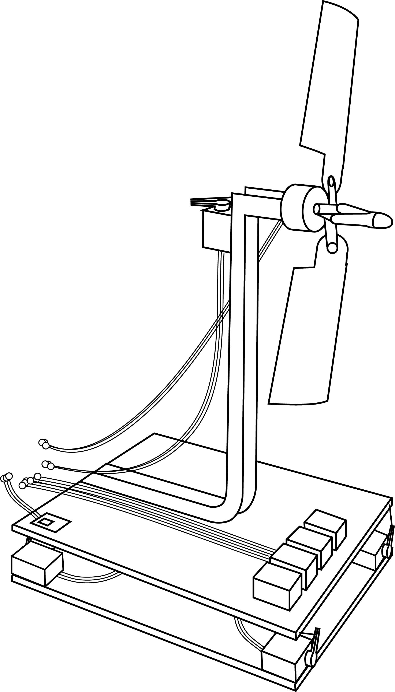
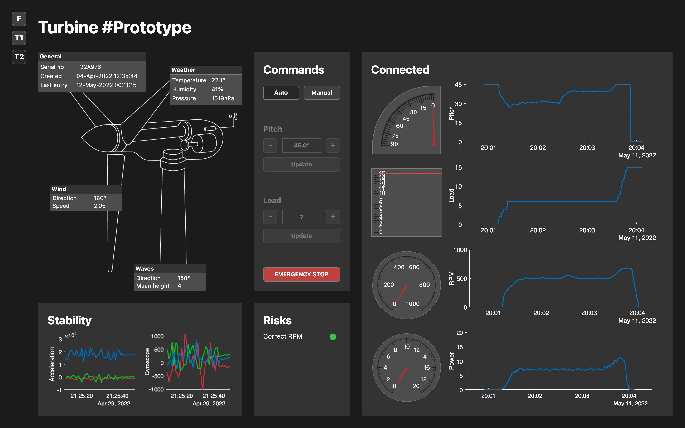

# Arquitectura-asequible-para-monitorizar-y-controlar-turbinas-offshore

 

  
  &nbsp; &nbsp; &nbsp; &nbsp; &nbsp; &nbsp; &nbsp; &nbsp; &nbsp; &nbsp; &nbsp; &nbsp;
  

 

## Índice
- Resumen
- Agradecimientos  
- Introducción  
  - Preliminares  
    - Motivación  
    - Objetivos  
    - Asignaturas relacionadas  
    - Plan de trabajo  
    - Estructura de la memoria  
  - Turbinas eólicas
    - Modelo
    - Esquema de control
    - Problemática
  - Gemelo Digital
    - Definición
    - Origen
    - Tipos
    - Aplicación y beneficios
- Desarrollo del sistema
  - Aprendizaje y dominio de las tecnologías
    - Desarrollo de un lazo de control básico
    - Monitorización y almacenamiento en un servidor
    - Control y monitorización con multihilo
    - Aportaciones
  - Interfaz de control del Gemelo Digital
    - Herramientas
    - Implementación del modelo
    - Implementación de la vista
    - Implementación del controlador
    - Simulador
    - Aportaciones
  - Software integrado en el prototipo
    - Modelo del prototipo de turbina
    - Implementación
    - Aportaciones
- Análisis y discusión de resultados
  - Casos de uso
    - Ciclo de funcionamiento automático completo
    - Funcionamiento manual
    - Aportaciones
  - Conclusiones y trabajos futuros
- Bibliografía

## Aportaciones

### Aprendizaje y dominio de las tecnologías
A lo largo de este capítulo se han introducido las herramientas y las soluciones necesarias para el desarrollo de un prototipo de monitorización y control de una turbina eólica de baja fidelidad. La base del proyecto, un microcontrolador mononúcleo, componentes hardware sencillos, el entorno de desarrollo de Arduino y el servidor ThingSpeak, tuvo que ser modificada para solucionar limitaciones y alcanzar el resultado deseado. Para evitar los tiempos de espera en las instrucciones de comunicación con el servidor, se sustituye el microcontrolador mononúcleo por otro con dos procesadores; para sortear las limitaciones de la licencia gratuita de ThingSpeak se empaquetan y suben los datos en formato de archivo JSON.

### Interfaz de control del Gemelo Digital
En este capítulo, se ha descrito la implementación completa del Gemelo Digital de una granja eólica. Expone el novedoso proceso de cómo aplicar el patrón de diseño Modelo-Vista-Controlador en MATLAB y cuál ha sido el resultado de cada una de sus partes. En primer lugar, el modelo se encarga de acceder a ThingSpeak y de almacenar la información del estado y la estabilidad de la turbina, así como de gestionar el envío de comandos. En segundo lugar, la vista muestra dicha información al usuario y le permite interactuar con las turbinas mediante una interfaz que cumple con los principios de diseño. En tercer lugar, el controlador gestiona los eventos de la vista y del modelo y fuerza a que se muestren datos actualizados mediante el uso de temporizadores. Por último, se ha presentado el simulador de turbina eólica flotante creado para realizar pruebas en el Gemelo Digital y se ha visto cómo atajar los problemas de su funcionamiento en tiempo real.

### Software integrado en el prototipo
En este capítulo se recoge el desarrollo completo del software integrado en el microcontroaldor ESP32 del prototipo de turbina eólica. Antes de proceder al desarrollo, muestra el prototipo del que se dispone y sus componentes. Comienza esbozando el software de manera general e introduciendo las estructuras internas de datos. También hace especial énfasis en las estructuras encargadas de la comunicación entre hilos mediante paso de mensajes. A continuación, describe las estructuras partiendo de las más concretas para llegar a las más abstractas: primero, los monitores y los controladores, y después, la clase de la tarea de la turbina y la clase de la tarea de las comunicaciones.  

Aunque no se recoge un diagrama UML global, se presenta de forma mucho más clara dividido en subdiagramas. Resulta más sencillo para una interpretación a primera vista y permite una inmersión posterior en aspectos más concretos si fuera necesario.
